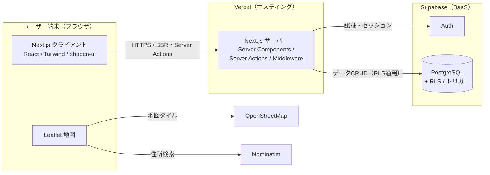

# チラトラ｜チラシ配布実績管理アプリ（flyer-tracker）

**地図上のピンでチラシ配布の実績を記録・共有・分析する、モバイルファーストの業務Webアプリ。**
配布場所と配布履歴を分離したリレーショナル設計とし、各場所のピンの色は「直近の配布評価」で自動的に出し分ける。


> 企画・要件定義・DB設計・実装・テスト・デプロイ・ドキュメント作成までを一貫して行った**個人開発**プロジェクト。

---

## 解決する課題

チラシのポスティングは「いつ・どこに・何枚・どんな手応えだったか」が紙や記憶に埋もれて属人化しがち。
同じ場所への重複配布や、効果の振り返りができないという現場の悩みがある。

本アプリは **地図 × 記録 × チーム共有** で以下を実現する。

- 配布実績を**地図上のピン**で直感的に記録・可視化
- ピンの色（緑=良好／灰=普通／赤=非推奨）で**その場所の直近評価が一目**で分かる
- チームで共有・相互編集しつつ、**「誰が・いつ・何を変えたか」を監査ログで追える**

## 主な機能

**地図（ホーム）**
- 配布場所ピンを直近評価で色分け表示／ピンにカーソルで過去の配布履歴をプレビュー
- 地図タップでその地点に配布場所・メモを登録（**GPS現在地**取得・住所検索での位置指定にも対応）
- 汎用の色付きメモ（マップメモ）を地図上に配置

**一覧**
- 配布履歴の一覧・**インライン編集**・期間/小学校での絞り込み・サマリー集計
- **変更履歴ビュー**（誰が・いつ・変更前→後）／論理削除と復元
- 報告用に **タブ区切りテキストでコピー**（PCではテーブル表示、スマホはカード表示）

**認証・マスタ**
- Supabase Auth（メール＋パスワード、初回はメールリンク）でメンバー限定
- 小学校マスタ管理（座標登録つき）

## こだわった設計・実装ポイント

| 観点 | 内容 |
|---|---|
| **セキュリティ** | 全テーブルに **Row Level Security (RLS)** を適用し、未認証はデータ取得不可。パラメータ化クエリ＋自動エスケープでSQLインジェクション/XSSを防止。公開anon key前提でサインアップも無効化 |
| **監査性** | `visits` の変更を **PostgreSQLトリガーで自動的に監査ログへ記録**（create/update/delete と before/after を jsonb 保存）。削除は**論理削除**で復元可能 |
| **アーキテクチャ** | Next.js App Router の**サーバーコンポーネント＋サーバーアクション**でデータ取得・更新を型安全に実装（TypeScript strict）。ミドルウェアで認可を集中管理 |
| **再利用設計** | 地図ピッカー・登録ダイアログ等をコンポーネント化し、複数画面で共有。重複コードを排除 |
| **地図** | Leaflet + OpenStreetMap + Nominatim(住所検索) の**無料構成**。直近評価をSQLビューで算出しピン色に反映 |
| **保守性** | `schema.sql` は**冪等**（再実行可能）。設計書・テスト仕様書・変更/バグ管理表を整備し、開発中に検出した不具合も記録 |

## システム構成



## 技術スタック

| 層 | 採用技術 |
|----|----------|
| フロント | Next.js 15 (App Router) / React 19 / TypeScript |
| UI | Tailwind CSS v4 / shadcn/ui / lucide-react |
| 地図 | Leaflet / react-leaflet / OpenStreetMap / Nominatim |
| 認証・DB | Supabase（Auth / PostgreSQL / RLS / トリガー / ビュー） |
| ホスティング | Vercel |

## 画面構成

```
/            地図（ホーム。ピン表示・登録・配置・メモ）
/list        一覧（配布履歴の一覧・登録・編集・削除・変更履歴・コピー）
/schools     小学校マスタ管理
/login       ログイン（メール+パスワード。初回はメールリンク）
```

## ドキュメント

- [設計書](./docs/設計書.md) — システム構成図・ER図・画面遷移図・認証シーケンス
- [要件メモ](./REQUIREMENTS.md) — 機能要件
- [テスト仕様書](./docs/テスト仕様書.md) — 機能別テストケース
- [変更管理表](./docs/変更管理表.md) ／ [バグ管理表](./docs/バグ管理表.md) — 変更履歴・不具合対応
- [構想・ロードマップ](./docs/構想・ロードマップ.md) — 今後の拡張構想

---

## 開発者向け: セットアップ

```bash
npm install
cp .env.example .env.local   # Supabase の URL / anon key を記入
npm run dev                  # http://localhost:3000
```

### 環境変数（`.env.local`）

| 変数 | 説明 |
|---|---|
| `NEXT_PUBLIC_SUPABASE_URL` | Supabase プロジェクトの URL |
| `NEXT_PUBLIC_SUPABASE_ANON_KEY` | Supabase の anon public key |
| `NEXT_PUBLIC_SITE_URL` | メールリンクのリダイレクト先（開発は `http://localhost:3000`） |

### Supabase

1. [supabase.com](https://supabase.com) でプロジェクトを作成
2. SQL Editor で `supabase/schema.sql` を実行（テーブル・トリガー・ビュー・RLS を作成）
3. Authentication → URL Configuration にリダイレクト URL（`http://localhost:3000/auth/confirm` と本番URL）を登録
4. Authentication → Users からメンバーを追加（メール＋パスワード。初回ログイン後にアプリ内でパスワード設定も可）

### デプロイ（Vercel）

1. GitHub リポジトリを Vercel でインポート
2. Environment Variables に上記3変数を設定（`NEXT_PUBLIC_SITE_URL` は本番URL）
3. 独自ドメインを使う場合は Vercel の Domains に追加し、DNS(CNAME) を Vercel へ向ける
4. Supabase の Auth リダイレクトURLに本番URL（`/auth/confirm`）を追加

<details>
<summary>デモ環境（ワンクリックログイン付き）の構築手順</summary>

本番とは別の Supabase プロジェクト＋Vercel プロジェクトで、データを分離したデモ環境を用意できる。

1. Supabase でデモ用プロジェクトを作成し、`supabase/schema.sql` → `supabase/seed_demo.sql`（ダミーデータ）を実行
2. Email+パスワード認証を有効化し、デモ用アカウントを作成（Auto Confirm）
3. 同じリポジトリから Vercel で2つ目のプロジェクトを作成し、環境変数に加えて
   `NEXT_PUBLIC_DEMO_MODE=1` / `NEXT_PUBLIC_DEMO_EMAIL` / `NEXT_PUBLIC_DEMO_PASSWORD` を設定
4. デモのドメインを割り当て、Auth リダイレクトURLを登録

`NEXT_PUBLIC_DEMO_MODE=1` の環境だけログイン画面に「デモとしてログイン」ボタンが表示される。

</details>
