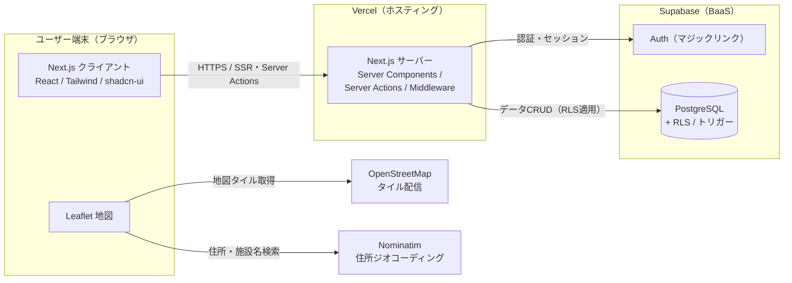
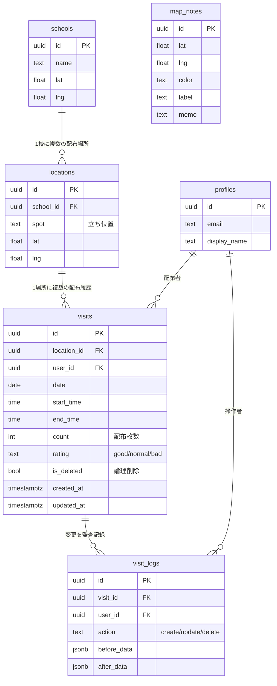
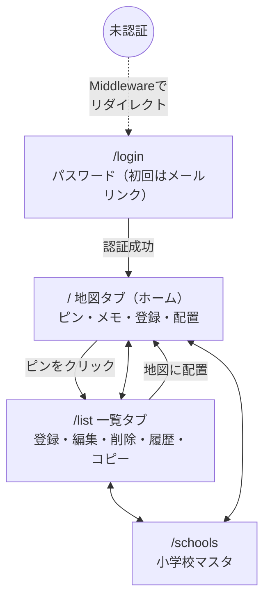
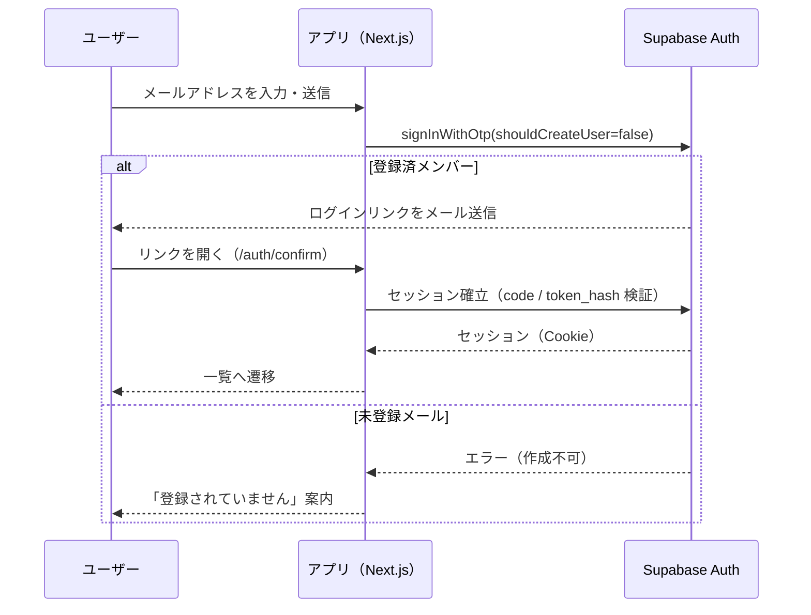

# 設計書（チラシ配布実績管理アプリ）

本書はアプリの基本設計をまとめたもの。機能要件は [REQUIREMENTS.md](../REQUIREMENTS.md)、
変更・不具合・テストは [docs/](./) 配下の各表を参照。
※ 図は Mermaid 記法。GitHub 上ではそのまま図として描画される。

---

## 1. システム概要

チラシのポスティング実績を、地図上のピンで記録・管理する Web アプリ。
「配布場所（location）」と「配布履歴（visit）」を分離したリレーショナル設計とし、
各場所のピンの色は「その場所の直近の配布評価」で出し分ける（大島てる的な体験）。

- 想定利用者: 少人数のチーム（相互に閲覧・編集し合う）
- 端末: スマートフォン主体（PC でも利用可、PC は一覧をテーブル表示）

---

## 2. システム構成図

### 技術スタック

| 層 | 採用技術 | 備考 |
|----|----------|------|
| フロント | Next.js 15（App Router）/ TypeScript / React 19 | SSR・Server Actions |
| UI | Tailwind CSS v4 / shadcn/ui / lucide-react | モバイルファースト |
| 地図 | Leaflet / react-leaflet / OpenStreetMap | 無料・APIキー不要 |
| 住所検索 | Nominatim（OSM） | 無料・ボタン検索でレート配慮 |
| 認証 | Supabase Auth（マジックリンク） | メンバー限定 |
| DB | Supabase PostgreSQL（RLS / トリガー / ビュー） | 監査ログ自動記録 |
| ホスティング | Vercel | 独自ドメイン（flyer.〜） |

---

## 3. データベース設計（ER 図）

- `map_notes` は配布実績とは独立した、地図上の汎用メモ（色＋見出し＋メモ。色に固定の意味は持たせない）。
- テーブルの列定義詳細は [REQUIREMENTS.md](../REQUIREMENTS.md) 4章、実体は [supabase/schema.sql](../supabase/schema.sql)。

### 主要ロジック
- **ピン色決定**: ビュー `location_pin_status` が、各 location の未削除 visits のうち
  「date, start_time が最新」の1件の rating を返す。緑=good / 灰=normal / 赤=bad / 履歴なし=グレー。
- **監査ログ**: `visits` への INSERT/UPDATE をトリガー `log_visit_changes` が捕捉し、
  `visit_logs` に create/update/delete と before/after(jsonb) を自動記録。
- **論理削除**: 物理削除は行わず `is_deleted` フラグで管理。RLS でも DELETE を許可しない。

---

## 4. 画面構成・画面遷移

| 画面 | パス | 主な機能 |
|------|------|----------|
| ログイン | `/login` | メール+パスワード（初回はメールリンク。デモ環境はワンクリックログイン） |
| 地図（ホーム） | `/` | ピン表示（色分け）・ホバーで履歴・クリックで一覧・登録ボタン・配置・住所検索・マップメモ |
| 一覧 | `/list` | 登録・インライン編集・論理削除/復元・フィルタ・変更履歴・履歴コピー |
| 小学校マスタ | `/schools` | 追加・削除・座標登録 |

---

## 5. 認証・認可設計

### マジックリンク認証シーケンス

### 認可（アクセス制御）
- **Middleware**: 全リクエストでセッションを検証。未認証は `/login` へリダイレクト。
- **RLS（Row Level Security）**: 全テーブルで有効。`authenticated` ロールのみ参照・更新可、
  `anon`（未認証）は一切アクセス不可。`visits` は物理 DELETE 不可（論理削除運用）。
- **サインアップ制御**: Supabase 側で新規サインアップを無効化。メンバーは管理者が Users から追加。
- **監査**: 誰でも編集・削除できるが、操作は必ず `visit_logs` に記録される。

---

## 6. 外部連携

| 連携先 | 用途 | 方式・留意点 |
|--------|------|--------------|
| OpenStreetMap | 地図タイル配信 | 無料。帰属表示を地図に明記 |
| Nominatim | 住所→座標の変換（住所検索） | 無料。利用規約に配慮しボタン押下時のみ問い合わせ（連続リクエストを避ける） |

---

## 7. 非機能・運用

- **セキュリティ**: RLS による行レベル制御、パラメータ化クエリ（SQLインジェクション対策）、
  React による自動エスケープ（XSS対策）、公開キー前提でのサインアップ無効化。
- **デプロイ構成**: Vercel（本番 `flyer.〜`）。ポートフォリオ用にデータ分離した
  デモ環境 `flyerdemo.〜`（別 Supabase・ワンクリックログイン）を別 Vercel プロジェクトで構築可能。
- **スキーマ管理**: `supabase/schema.sql` は冪等（再実行可能）に記述し、常に全実行で最新化できる。
- **品質管理**: [テスト仕様書](./テスト仕様書.md) / [変更管理表](./変更管理表.md) / [バグ管理表](./バグ管理表.md)。
